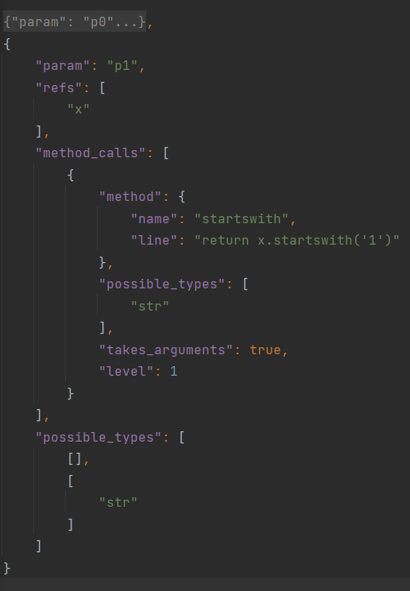

# Parameter Type Matcher

Parameter Type Matcher is a side-project that aims to programmatically determine
the data type of all the parameters that are noted in a function definition. The
idea for this project came from my Bachelor's Thesis which focused on the generation
of synthetic data for Python classes.

## Installation

This project is not current added as a package and need to be pulled from the repository.
The code can be easily executed from any IDE by running the **param_match.py**

## File Explainer

This section gives a brief explanation about the idea of the different files inside the project.

| File | Description |
| --- | -- |
| generator | Handles the conversion from data types to their default data equivalents and records possible executions of the function. For example: str, int, list, dict -> '', 1, [], {} |
| helpers| Helpers functionalities like logging |
| param_match | The main file of the project. Works with the **dis** package to break down the function's body into operations. Based on the operations, possible data types for the parameters are recorded and a JSON representation of the breakdown in created. |
| type_operations | Used to execute the project, breaks down the function docstring into 3 parts: name, parameters and body. |

## Examples

As seen in the **param_match.py** there is a test docstring containing a function:
```python
def test(p0, p1):
    # Records a reference to a parameter/s
    x = p0 * p1

    # Used to verify that only type specific methods get recorded
    print(p0)

    # Calls type specific methods
    p0.upper()
    return x.startswith('1')
```

Executing the project creates a JSON breakdown of the function that looks like this:


Finally, a list of all the possible function calls is returned. The program guarantees that all the returned examples compile correctly.

## Current Limitations

Currently, this project doesn't have a good way to create connections between parameters.
For example ```x = p0 * p1``` means that local variable **x** refers to both parameters
but that doesn't necessarily mean that it can be used to guess the type of both parameters.

Another limitation is that the project has a limit to the level of abstraction it can capture when it comes to references to parameters.
The current number of abstraction level is five, which can be seen as something like this:
```python
def function(p0):
    a = p0      # level 1 - direct reference to a parameter
    b = a       # level 2 - indirect reference to a parameter
    c = b       # level 3
    d = c       # level 4
    e = d       # level 5
```
Anything more abstract that the example above will not be recorded by the current version of the algorithm